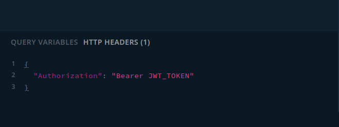

<h1 align="center">
    
    <br>
    First steps
</h1>

## Installing a Local Game Instance

The first step in setting up any game is to install a local instance. You can find a guide for doing that here: [Installation guide](/docs/install/installation.md).

## Checking if Your Local Instance is Up and Running

The last step in the installation guide explains how to start the game instance. In the console output, you should see something like this:

```
App is loaded at http://[::1]:3000/graphql URL
See documentation at http://[::1]:3000/doc URL
```

In the `doc` path, you can find the API paths needed to authenticate yourself in `Warp Core`. When you enter that page, you should see a Swagger documentation page.  
The `graphql` path contains the main GraphQL access to `Warp Core`. On localhost, you can access the Apollo GraphQL interface with syntax check.

## Registering Your First Account

The `Warp Core` game engine does not intend to check new user credentials. That should be done elsewhere. The main goal is to use `Warp Core` as a single multi-world instance. In this step, we just want to create a local habitat for the selected user.

To create a local habitat for a new user, send a `GET` request to the server on the `/auth/create/{id}` path, where `{id}` is a unique number in the current database. You can do this with a simple cURL command:

```sh
curl -X GET '[::1]:3000/auth/create/{id}'
```

As a response, you will receive a JSON object that will allow you to obtain a JWT token:

```json
{
  "userId": {id},
  "habitatId": {habitat_id}
}
```

### Example

Suppose we want to create a new habitat for user id *3*. Our `cURL` command would look like this:

```sh
curl -X GET '[::1]:3000/auth/create/3'
```

The response to that command would be:

```json
{
    "userId":3,
    "habitatId":1
}
```

## Logging Into Your Account

Now we are able to log into our habitat using the JSON response obtained from the registration step. Logging in will provide us with a JWT token.

To log into our local habitat, we need to send a `POST` request to the server on the `/auth/login` path with the same JSON object we received during registration. Here's a `cURL` command for it:

```sh
curl -X POST \
  '[::1]:3000/auth/login' \
  --header 'Content-Type: application/json' \
  --data-raw '{
  "userId": {id},
  "habitatId": {habitat_id}
}'
```

As a response, you will receive a JSON object with a JWT token:

```json
{
  "access_token": "Bearer JWT_TOKEN"
}
```

### Checking Your Access

To make sure your JWT token is working, you can access your habitat details by sending a `GET` request to the `/auth/profile` path using the token obtained during the login step. Here's the `cURL` command to do that:

```sh
curl -X GET \
  '[::1]:3000/auth/profile' \
  --header 'Authorization: Bearer JWT_TOKEN'
```

The response will contain a JSON object with the habitat details (the data below is an example from the registration section):

```json
{
  "id": 1,
  "name": "New habitat",
  "userId": 3,
  "isMain": true
}
```

## Authenticating GraphQL Connections

Every action in GraphQL should be authenticated using the request header:

```
Authorization: Bearer JWT_TOKEN
```

If you are using the Apollo GraphQL interface, you can insert your authorization token into the `HTTP HEADERS` section in the bottom left corner. Just enter a JSON object containing the obtained JWT token:

```json
{
  "Authorization": "Bearer JWT_TOKEN"
}
```


